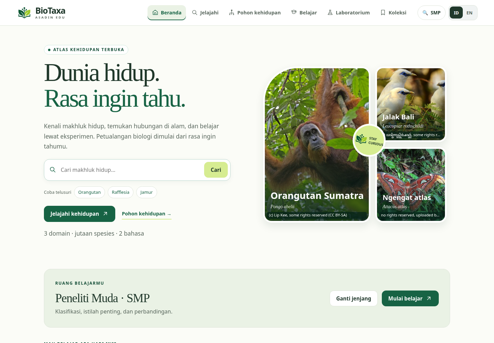
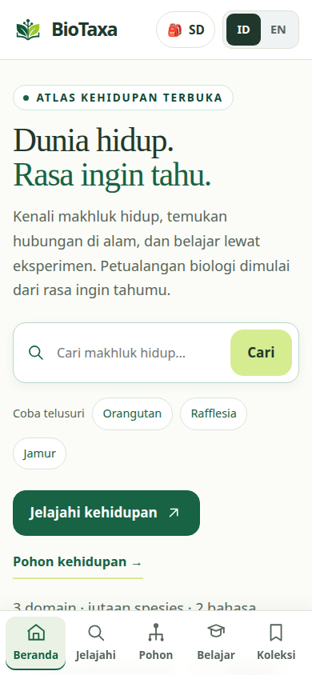
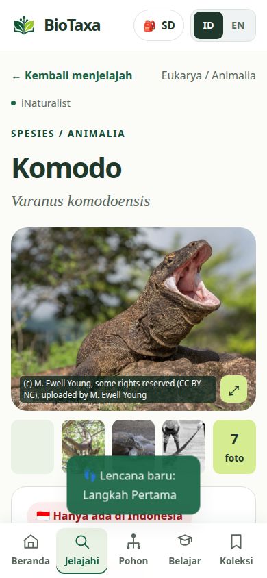

# BioTaxa · Asadin Edu

**Atlas makhluk hidup yang terbuka, gratis, dan dwibahasa (Indonesia/English) untuk siswa SD sampai mahasiswa, serta guru.** Jelajahi jutaan spesies dari GBIF dan iNaturalist, pelajari materi Kurikulum Merdeka, coba simulasi laboratorium, dan bawa kelas belajar di luar ruangan.



<p>
  
  
</p>

English version: [see below](#english).

## Satu aplikasi, lima mode

Saat pertama dibuka, pengunjung memilih jenjang. Pilihan ini mengubah ukuran huruf, bahasa penjelasan, isi materi, tab yang tampil, dan urutan kegiatan. Mode bisa diganti kapan saja.

| Mode                 | Untuk          | Yang disesuaikan                                                                                                                                                   |
| -------------------- | -------------- | ------------------------------------------------------------------------------------------------------------------------------------------------------------------ |
| **Penjelajah Cilik** | SD (Fase A–C)  | Huruf besar, nama sehari-hari lebih dulu, kartu spesies berbahasa sederhana, tombol **Bacakan**, kuis tebak foto, lencana                                          |
| **Peneliti Muda**    | SMP (Fase D)   | Klasifikasi dengan istilah yang bisa diklik, bandingkan spesies, rantai makanan, lebih banyak simulasi                                                             |
| **Ilmuwan**          | SMA (Fase E–F) | Materi mendalam (pewarisan sifat, evolusi, reaksi terang dan gelap fotosintesis), penjelasan lanjutan di kamus, kode status IUCN, dan deskripsi dari sumber ilmiah |
| **Akademik**         | Kuliah         | Nama beserta author, sinonim, sitasi BibTeX, unduh data temuan (CSV), tautan ke NCBI/GenBank, IUCN, dan Open Tree of Life                                          |
| **Guru**             | Pengajar       | Tujuan pembelajaran, langkah, asesmen, kunci jawaban, tugas lewat tautan, dan modul ajar siap cetak                                                                |

## Fitur

- **Pencarian yang memahami bahasa anak.** Mengetik "hiu", "sapi", atau "nyamuk" langsung menampilkan hewan yang dimaksud beserta kelompoknya. Galeri menampilkan makhluk hidup yang tercatat **di Indonesia**, dengan pilihan untuk melihat seluruh dunia.
- **Pohon kehidupan** dari GBIF sampai tingkat famili, genus, dan spesies. Kelompok yang dikenal anak (misalnya "Hewan bertulang belakang") tampil lebih dulu dengan nama dan penjelasan yang ramah.
- **111 kartu spesies kurasi** yang ditulis dengan bahasa sederhana: satwa endemik, hewan ternak, tanaman pangan, jamur, dan mikroba. Status konservasi dijelaskan dengan kata-kata ("Kritis, hampir punah"), bukan kode.
- **12 topik materi** sesuai Kurikulum Merdeka, dari ciri makhluk hidup sampai evolusi dan kehidupan purba. Setiap topik punya teks per jenjang, kegiatan, catatan guru, bacaan lanjutan, dan total **76 soal kuis** dengan penjelasan.
- **7 simulasi laboratorium**: fotosintesis, rantai makanan, osmosis, persilangan Mendel, seleksi alam, skala kehidupan, serta tuas & capit. Buku eksperimen tersimpan dan bisa dicetak.
- **Kamus 103 istilah.** Istilah bergaris di materi dan kartu spesies bisa diklik.
- **Bandingkan dua spesies**, lengkap dengan tingkat klasifikasi tempat keduanya mulai berbeda.
- **Di sekitarku.** Makhluk hidup yang pernah diamati di sekitar rumah atau sekolah. Lokasi dibulatkan sekitar 1 km sebelum dikirim.
- **Kehidupan purba.** Garis waktu geologi, 29 makhluk purba dan punah, rentang fosil langsung dari Paleobiology Database, dan filter temuan Indonesia.
- **Paspor Penjelajah** dengan 12 lencana, koleksi, dan catatan belajar yang tidak hilang saat halaman dimuat ulang. Semua data bisa diekspor dan diimpor.
- **Bisa dipakai offline (PWA).** Materi, kamus, dan simulasi tetap terbuka tanpa internet. Halaman yang pernah dibuka disimpan di perangkat.
- **Aksesibel dan aman.** Diuji dengan axe (WCAG 2.1 AA), bisa dipakai dengan keyboard, menghormati pengaturan kurangi animasi, dan rapi dari lebar 320 px sampai 1440 px. Tanpa akun, tanpa iklan, tanpa analitik.

## Menjalankan

### Pengembangan

Butuh Node.js 20 atau lebih baru.

```bash
npm ci
npm run dev        # http://127.0.0.1:8085
```

### Situs publik: Cloudflare Pages (disarankan)

Cloudflare Pages menyajikan aplikasi dari jaringan CDN secara gratis tanpa batas permintaan. Sanggup melayani puluhan ribu pengguna bersamaan. Batas yang sebenarnya ada pada API iNaturalist, dan BioTaxa menanganinya dalam tiga lapis:

1. **Snapshot API.** Setiap malam, GitHub Actions merekam respons API untuk halaman yang paling sering dibuka (galeri, 111 spesies kurasi, pencarian umum, pohon kehidupan) lalu menyajikannya sebagai file statis.
2. **Edge cache.** Permintaan lain lewat [functions/api/[[path]].js](functions/api/[[path]].js), yang menyimpan respons di cache Cloudflare. Satu kelas yang membuka halaman yang sama cukup memicu satu permintaan ke iNaturalist, dan IP sekolah tidak terkena batas.
3. **API langsung.** Jika edge cache sibuk atau kuotanya habis, aplikasi otomatis memanggil GBIF dan iNaturalist langsung dari browser.

Penjelasan kapasitas dan batasnya ada di [docs/SCALING.md](docs/SCALING.md).

Penyiapan (sekali saja):

1. Buat akun [Cloudflare](https://dash.cloudflare.com/sign-up) (gratis).
2. Buat API token di **My Profile → API Tokens → Create Token → Create Custom Token** dengan izin **Account · Cloudflare Pages · Edit**.
3. Salin **Account ID** dari **Workers & Pages** (panel kanan) di dashboard Cloudflare.
4. Di GitHub, buka **Settings → Secrets and variables → Actions**, lalu isi:
   - _Secrets_: `CLOUDFLARE_API_TOKEN` dan `CLOUDFLARE_ACCOUNT_ID`.
   - _Variables_: `CLOUDFLARE_PAGES_PROJECT`, misalnya `biotaxa`. Nama ini menjadi alamat `https://biotaxa.pages.dev` bila masih tersedia.
5. Buka **Actions → Deploy → Run workflow**, centang _Record a fresh API snapshot_, lalu jalankan. Deploy pertama memakan waktu sekitar 30 menit.
6. Jika alamat situs berbeda (misalnya memakai domain sendiri), isi variable `SITE_URL`, misalnya `https://biotaxa.id`, agar pratinjau tautan di WhatsApp dan media sosial benar.

Setelah itu, setiap push ke `main` yang lulus CI otomatis diterbitkan, dan snapshot diperbarui setiap pukul 02.00 WIB. Untuk mencoba di komputer sendiri dengan runtime Cloudflare:

```bash
npm run snapshot              # opsional, sekitar 30 menit
npm run preview:cloudflare    # http://127.0.0.1:8788
```

### Server sendiri untuk sekolah (Node.js atau Docker)

Cocok untuk server di jaringan lokal sekolah. `server/server.mjs` menyajikan aplikasi, menyimpan respons GBIF dan iNaturalist di cache, dan mengatur jeda permintaan untuk seluruh sekolah. Tidak butuh paket npm saat berjalan.

```bash
npm run snapshot    # opsional: server juga menyajikan data/snapshot/
PORT=8080 npm start
```

Atau dengan Docker:

```bash
docker build -t biotaxa .
docker run -d --restart unless-stopped -p 8080:8080 --name biotaxa biotaxa
```

Jika server berada di belakang reverse proxy (nginx, Caddy, Cloudflare, atau router PaaS), tambahkan `TRUST_PROXY=1`. Jika proxy itu melayani HTTPS, tambahkan juga `HSTS=1`.

Server ini dirancang untuk **satu sekolah**, bukan untuk situs publik. Semua pengguna berbagi satu antrean ke iNaturalist (sekitar 60 permintaan per menit), jadi untuk ribuan pengguna gunakan Cloudflare Pages.

| Variabel               | Bawaan            | Fungsi                                                                                                  |
| ---------------------- | ----------------- | ------------------------------------------------------------------------------------------------------- |
| `PORT`, `HOST`         | `8080`, `0.0.0.0` | Alamat server                                                                                           |
| `TRUST_PROXY`          | `0`               | Jumlah reverse proxy di depan server. Diperlukan agar batas per pengguna memakai alamat asli pengunjung |
| `HSTS`                 | mati              | `1` untuk mengaktifkan HSTS saat diakses lewat HTTPS                                                    |
| `CLIENT_LIMIT_PER_MIN` | `240`             | Batas permintaan API per alamat per menit                                                               |
| `INAT_INTERVAL_MS`     | `1000`            | Jeda minimum antarpermintaan ke iNaturalist                                                             |
| `CACHE_MAX_ENTRIES`    | `3000`            | Jumlah respons API yang disimpan di memori                                                              |
| `USER_AGENT`           | `BioTaxa/3 …`     | Identitas ke penyedia API. Isi dengan alamat situs atau kontak Anda                                     |
| `LOG`                  | mati              | `1` untuk mencatat setiap permintaan                                                                    |

### Hosting statis lain

`npm run build:site` menghasilkan folder `dist/` yang bisa diunggah ke hosting statis mana pun, misalnya GitHub Pages atau Netlify. Snapshot ikut disertakan bila sudah dibuat. Tanpa edge cache, permintaan lain langsung dari browser ke API.

### Pengaturan aplikasi

Ubah [js/config.js](js/config.js) bila menerbitkan salinan Anda sendiri:

- `repositoryURL` dan `feedbackURL` mengatur tautan repositori dan masukan. Halaman dukungan ada di `#/dukung`, melalui footer dan beranda. Isi `donateLocalURL` untuk kanal Indonesia dan/atau `donateInternationalURL` untuk kanal internasional dengan URL HTTPS halaman milik pengelola. Hanya kanal yang diisi dan valid yang muncul. `donateURL` tetap didukung sebagai tujuan tunggal jika kedua kanal belum tersedia. Jika semuanya kosong, halaman menyatakan donasi uang belum tersedia. Pembayaran, mata uang, bukti transaksi, dan pencairan ditangani penyedia; tidak ada API key atau webhook yang diperlukan.
- `allowNonCommercialMedia` menentukan apakah foto berlisensi NC ditampilkan. **Ubah menjadi `false` sebelum monetisasi.** Lihat [docs/LICENSING.md](docs/LICENSING.md).

Setelah mengubah berkas aplikasi, jalankan `npm run build` untuk memperbarui daftar cache offline di `sw.js`.

## Pengembangan dan pengujian

| Perintah                         | Fungsi                                                                                                             |
| -------------------------------- | ------------------------------------------------------------------------------------------------------------------ |
| `npm run check`                  | Semua pemeriksaan: lint, validasi konten, cache offline, dan tes browser                                           |
| `npm test`                       | 72 tes Playwright dengan data palsu, tidak butuh internet                                                          |
| `npm run smoke`                  | Menguji aplikasi yang sedang berjalan terhadap API sungguhan, lalu membuat ulang screenshot di `docs/screenshots/` |
| `npm run data:check`             | Memvalidasi konten kurasi. Tambahkan `-- --resolve` untuk mengisi ID dan foto spesies baru                         |
| `npm run snapshot`               | Merekam snapshot API ke `data/snapshot/`. Tambahkan `-- --quick` untuk uji singkat                                 |
| `npm run build:site`             | Menyusun `dist/` untuk hosting statis, termasuk snapshot dan `_headers`                                            |
| `npm run preview:cloudflare`     | Menjalankan `dist/` dan edge cache dengan runtime Cloudflare di komputer sendiri                                   |
| `npm run lint`, `npm run format` | ESLint dan Prettier                                                                                                |
| `npm run build`                  | Memperbarui daftar cache offline di `sw.js`                                                                        |

Tes memakai Google Chrome di `/usr/bin/google-chrome` bila ada. Atur `CHROME_PATH` untuk memakai peramban lain. Setiap push dan pull request diperiksa oleh [GitHub Actions](.github/workflows/ci.yml), termasuk build image Docker. [Deploy](.github/workflows/deploy.yml) ke Cloudflare Pages berjalan setelah CI lulus di `main`.

```text
index.html, sw.js, manifest.webmanifest
css/              style.css (komponen), layouts.css (tata letak responsif)
js/
  app.js          titik masuk: event global, catatan, lencana, service worker
  config.js       pengaturan penerbitan
  core/           router, preferensi (bahasa, jenjang, peran), penyimpanan, data pengguna
  components/     tata letak, kartu, kuis, saran pencarian, teks kaya dan kamus
  pages/          satu modul per halaman, dimuat saat dibutuhkan
  labs/           simulasi laboratorium
  services/       GBIF, iNaturalist, Wikipedia, PBDB, peta, lisensi foto, suara
  data/           konten kurasi (CC BY-SA 4.0): spesies, kelompok, kamus, materi, purba
  i18n/ui.js      teks antarmuka bersama
server/           server produksi untuk sekolah; policy.mjs = header keamanan dan aturan proxy bersama
functions/        edge cache Cloudflare Pages untuk /api/*
scripts/          validasi konten, pencari ID spesies, perekam snapshot, build situs, daftar cache offline
tests/            tes Playwright dan smoke test
assets/           logo, foto beranda, atlas dunia, Leaflet
docs/             lisensi dan monetisasi, skala, screenshot terbaru
data/snapshot/    (dibuat otomatis) snapshot API, tidak masuk git
dist/             (dibuat otomatis) situs siap terbit
```

## Sumber data dan batasannya

BioTaxa menampilkan data dari [GBIF](https://www.gbif.org), [iNaturalist](https://www.inaturalist.org), [Wikipedia](https://www.wikipedia.org), dan [Paleobiology Database](https://paleobiodb.org). Setiap foto menampilkan atribusi dan lisensinya.

Tidak ada satu sumber pun yang punya semua fakta tentang setiap makhluk hidup. Karena itu:

- Informasi yang tidak tersedia ditandai, bukan dikarang.
- Teks dari sumber luar tidak diterjemahkan otomatis. Pada spesies di luar 111 kartu kurasi, sebagian teks bisa berbahasa Inggris.
- Titik di peta adalah catatan temuan, bukan peta sebaran lengkap.
- Simulasi laboratorium adalah model untuk belajar, bukan pengukuran nyata.

## Lisensi

- **Kode**: [MIT](LICENSE)
- **Konten kurasi** di `js/data/`: [CC BY-SA 4.0](LICENSE-CONTENT.md)
- **Foto dan data dari luar** mengikuti lisensi masing-masing penyedia

Rincian lisensi dan daftar periksa sebelum monetisasi ada di [docs/LICENSING.md](docs/LICENSING.md).

## Berkontribusi

Guru, dosen, mahasiswa biologi, penerjemah, dan pengembang sangat diharapkan ikut membantu. Mulai dari [CONTRIBUTING.md](CONTRIBUTING.md). Proyek ini mengikuti [Kode Etik](CODE_OF_CONDUCT.md). Laporkan masalah keamanan sesuai [SECURITY.md](SECURITY.md). Riwayat perubahan ada di [CHANGELOG.md](CHANGELOG.md).

## English

BioTaxa is a free, open-source, bilingual atlas of life for learners from primary school to university, and for their teachers.

- **Five modes.** Primary, middle school, high school, university and teacher. Each changes text size, vocabulary, lessons, visible tabs and activities.
- **Features.** Child-friendly search and an Indonesia-first gallery (iNaturalist), a GBIF tree of life, 111 curated species cards in plain language, 12 curriculum lessons with 76 quiz questions, 7 lab simulations, a 103-term glossary, species comparison, "near me", prehistoric life with a geological timeline, badges, printable lesson plans and link-based assignments. It works offline as a PWA, is tested with axe for WCAG 2.1 AA, and has no accounts, ads or analytics.
- **Run it.** For development, run `npm ci && npm run dev`. For a public site, use Cloudflare Pages: the [Deploy workflow](.github/workflows/deploy.yml) publishes the static app, a nightly snapshot of the most requested API responses, and an edge cache Function for everything else. It needs the `CLOUDFLARE_API_TOKEN` and `CLOUDFLARE_ACCOUNT_ID` secrets and a `CLOUDFLARE_PAGES_PROJECT` variable. If the edge cache is busy, the app falls back to calling the APIs directly. For one school's own server, use `npm start` or Docker (`TRUST_PROXY=1` behind a reverse proxy, `HSTS=1` behind HTTPS). See [docs/SCALING.md](docs/SCALING.md).
- **Test it.** `npm run check` runs lint, content validation, the offline precache check and 72 Playwright tests. `npm run smoke` checks a running instance against the live APIs.
- **License.** Code is MIT and curated content is CC BY-SA 4.0. Photos and external data keep their own licenses. Before monetising, read [docs/LICENSING.md](docs/LICENSING.md).
- **Contribute.** See [CONTRIBUTING.md](CONTRIBUTING.md).
